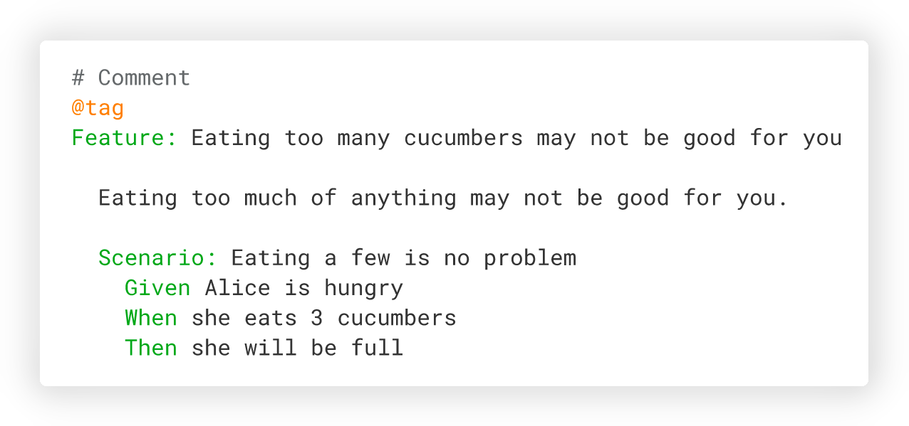

# Cucumber

[](https://vshymanskyy.github.io/StandWithUkraine)
[](https://opencollective.com/cucumber)
[](https://opencollective.com/cucumber)
[](https://github.com/cucumber/cucumber-ruby/actions/workflows/test.yaml)
[](https://codeclimate.com/github/cucumber/cucumber-ruby)
[](https://coveralls.io/r/cucumber/cucumber-ruby?branch=main)

Cucumber is a tool for running automated tests written in plain language. Because they're
written in plain language, they can be read by anyone on your team. Because they can be
read by anyone, you can use them to help improve communication, collaboration and trust on
your team.



This is the Ruby implementation of Cucumber. Cucumber is also available for [JavaScript](https://github.com/cucumber/cucumber-js),
[Java](https://github.com/cucumber/cucumber-jvm), and a lot of other languages. You can find a list of implementations here: https://cucumber.io/docs/installation/.

See [CONTRIBUTING.md](CONTRIBUTING.md) for info on contributing to Cucumber (issues, PRs, etc.).

Everyone interacting in this codebase and issue tracker is expected to follow the
Cucumber [code of conduct](https://cucumber.io/conduct).

## Installation

Cucumber for Ruby is a Ruby gem. Install it as you would install any gem: add
`cucumber` to your Gemfile:

    gem 'cucumber'

then install it:

    $ bundle

or install the gem directly:

    $ gem install cucumber

Later in this document, bundler is considered being used so all commands are using
`bundle exec`. If this is not the case for you, execute `cucumber` directly, without
`bundle exec`.

### Supported platforms

- Ruby 3.4
- Ruby 3.3
- Ruby 3.2
- Ruby 3.1
- Ruby 3.0
- TruffleRuby 24.0.0+
- JRuby 9.4+ (with [some limitations](https://github.com/cucumber/cucumber-ruby/blob/main/docs/jruby-limitations.md))

### Ruby on Rails

Using Ruby on Rails? You can use [cucumber-rails](https://github.com/cucumber/cucumber-rails) to bring Cucumber into your Rails project.

## Usage

### Initialization

If you need to, initialize your `features` directory with

    $ bundle exec cucumber --init

This will create the following directories and files if they do not exist already:

    features
    ├── step_definitions
    └── support
        └── env.rb

### Create your specification

Create a file named `rule.feature` in the `features` directory with:

```gherkin
# features/rule.feature

Feature: Rule Sample

  Rule: This is a rule

    Example: A passing example
      Given this will pass
      When I do an action
      Then some results should be there

    Example: A failing example
      Given this will fail
      When I do an action
      Then some results should be there
```

### Automate your specification

And a file named `rule_steps.rb` in `features/step_definitions` with:

```ruby
# features/step_definitions/steps.rb

Given('this will pass') do
  @this_will_pass = true
end

Given('this will fail') do
  @this_will_pass = false
end

When('I do an action') do
  :no_op
end

Then("some results should be there") do
  expect(@this_will_pass).to be true
end
```

### Run Cucumber

    $ bundle exec cucumber

To execute a single feature file:

    $ bundle exec cucumber features/rule.feature

To execute a single example, indicates the line of the name of the example:

    $ bundle exec cucumber features/rule.feature:5

To summarize the results on the standard output, and generate a HTML report on disk:

    $ bundle exec cucumber --format summary --format html --out report.html

For more command line options

    $ bundle exec cucumber --help

You can also find documentation on the command line possibilities in [features/docs/cli](features/docs/cli).

## Documentation and support

- Getting started, writing features, step definitions, and more: https://cucumber.io/docs
- Ruby API Documentation: http://www.rubydoc.info/github/cucumber/cucumber-ruby/
- Community support forum: https://github.com/orgs/cucumber/discussions
- Discord: [register for an account](https://cucumber.io/docs/community/get-in-touch#discord)

## Copyright

Copyright (c) Cucumber and Contributors. See LICENSE for details.
